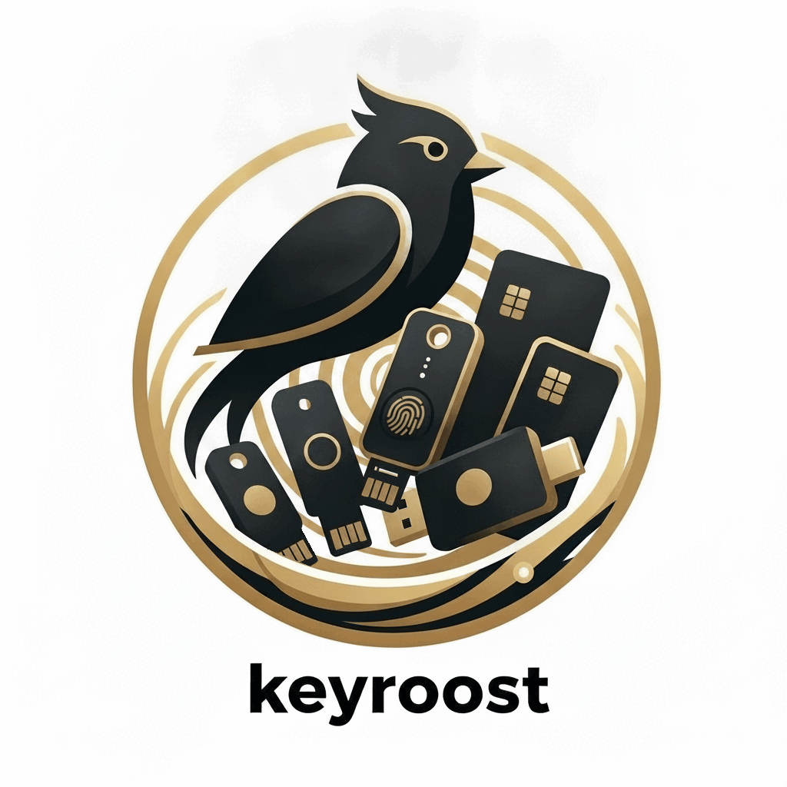

<p align="center">
  
</p>

# keyroost

An independent, vendor-neutral app for managing all your hardware security keys
in one place.

## What it is

keyroost is an open-source Rust toolchain for hardware security keys, working
across vendors over PC/SC and USB HID. It speaks FIDO2/CTAP2, OATH (TOTP/HOTP),
and the OpenPGP and PIV card protocols, manages on-device OTP on Token2 FIDO keys,
and also programs the Token2 Molto2 / Molto2v2 TOTP token. Ships a Rust library,
a CLI (`keyroostctl`), and a dark-themed desktop GUI (`keyroost`) — implemented
from public standards, with no vendor SDKs, no Python, and no Qt.

> **Built with AI.** I saw a real need for this but never learned to code, so
> the parts I author — code, docs, and all — are written end-to-end with AI.
> (Contributions from others, such as Token2's, are their own human-designed and
> -developed work — see the Contributors section.) Since the AI I use learned
> from the vast commons of free and open-source software people have generously
> shared, releasing keyroost as FOSS isn't really a choice; it's giving back to
> what made it possible. Issues, review, and contributions are warmly welcome.

**New to hardware keys?** Read the companion guide —
[*"So you bought a hardware security key… now what?"*](https://framefilter.github.io/keyroost/) —
a short, vendor-neutral tour of what FIDO2, OATH, OpenPGP, and PIV actually do.

## What it does

- **FIDO2 / CTAP2** — enumerate authenticators, read `authenticatorGetInfo`,
  manage resident credentials (list / metadata / delete), set / change / verify
  the PIN, reset a key. PIN protocols v1 and v2. CTAP 2.1 security policy over
  `authenticatorConfig` (always-require-UV, minimum PIN length, force a PIN
  change, enterprise attestation) and a `large-blob` store for plaintext notes
  over `authenticatorLargeBlobs`. Works over USB-HID and over a PC/SC reader —
  both NFC (CTAP-over-NFC) and a contact / ISO-7816 chip reader (T=0) — not just
  direct USB. Resident-credential metadata surfaces the fuller passkey detail
  too: the user's UPN, display name, user id, and the full credential id.
- **OATH (TOTP/HOTP)** — list, add, delete, and compute codes over PC/SC,
  including applet-password set / clear / unlock. In the GUI, secret fields have
  a reveal (eye) toggle so you can check an OTP secret before committing it.
- **OpenPGP card (v3.4)** — read status; generate or import RSA-2048 keys (host
  keygen or a PKCS#1/PKCS#8 PEM/DER file) for the signature, encryption, or
  authentication slot — each writes the v4 fingerprint and a generation timestamp
  so GnuPG recognizes the key; sign (SHA-256 or SHA-1); decrypt; authenticate (a
  client/SSH signature with the Authentication key via INTERNAL AUTHENTICATE);
  set cardholder name / URL; change the user / admin PIN and unblock a locked
  PIN; factory-reset the applet.
- **PIV (SP 800-73-4)** — full management: status (applet/firmware version,
  serial, PIN retries, which slots 9A/9C/9D/9E hold a certificate), on-card key
  generation, certificate import / export, self-signed certs or a CSR for a CA,
  clearing a slot's certificate (`delete-cert`) or key (`delete-key`, on YubiKey
  5.7+), and PIN / PUK / management-key changes and applet reset. The GUI collects the
  management key per operation (and wipes it after), which is ideal for a slot or
  two; for **provisioning many slots or keys, the CLI is the intended path** — the
  management key and PIN come from env/stdin once, so a shell loop does the batch
  (see the [PIV guide](https://framefilter.github.io/keyroost/piv.html)).
- **Token2 Molto2 / Molto2v2** — program a slot from an `otpauth://` URI;
  bulk-import from Aegis (plaintext or encrypted), 2FAS, a list of `otpauth://`
  URIs, or a QR code scanned from a PNG/JPEG screenshot or the live screen; sync
  the host clock; rotate the customer key; factory reset.
- **Token2 single-profile programmable TOTP token** — program the seed and TOTP
  configuration onto Token2's single-account card/fob tokens (OTPC-P1-i / P2-i,
  miniOTP-2-i / 3-i, C301-i, C302-i) over a PC/SC reader. These authenticate
  with a fixed device key rather than a customer key, and hold one account
  rather than many; keyroost reads the device serial / model and on-device
  clock, writes the seed, and sets the HMAC algorithm, time-step, and
  display-timeout (`prog info` / `seed` / `config`, or the GUI's
  programmable-token pane). The wire protocol is documented in
  [`docs/PROTOCOL-token2prog.md`](docs/PROTOCOL-token2prog.md).
- **Token2 on-device OTP (PIN+ Series FIDO keys)** — store TOTP/HOTP credentials
  directly on a Token2 FIDO security key and read their codes over USB-HID, NFC,
  or CCID; configure the single HOTP-on-touch keystroke slot; read the serial;
  and enable / disable the key's USB interfaces (FIDO / keyboard-HID / CCID).
- **Friendly device names** — an opt-in `keys.json` registry to target a specific
  physical key by name when several are connected, instead of by a reshuffling
  `/dev/hidrawN` path. Destructive operations always resolve to an explicit
  target, never a default. The registry lives under `%APPDATA%` on Windows (the
  platform config dir elsewhere), and names are validated with anti-spoofing
  checks while allowing a relaxed, readable character set.

## Supported devices

| Device | Capabilities | Notes |
|---|---|---|
| **Token2 Molto2 / Molto2v2** | TOTP slot programming, bulk import | Hardware-verified. Programmed over the vendor-specific SM4-MAC protocol ([docs/PROTOCOL.md](docs/PROTOCOL.md)); supports bulk import from Aegis / 2FAS / otpauth-list, clock sync, and customer-key rotation. |
| **Token2 single-profile tokens** (OTPC-P1-i / P2-i, miniOTP-2-i / 3-i, C301-i, C302-i) | Single-account TOTP seed + config programming | Programmed over the vendor-specific SM4-MAC protocol with a fixed device key ([docs/PROTOCOL-token2prog.md](docs/PROTOCOL-token2prog.md)); writes the seed and the TOTP algorithm / time-step / display-timeout over a contact or contactless PC/SC reader. The model is recognized from the device serial. |
| **Token2 PIN+ Series** | FIDO2 (+ bio), OTP, OpenPGP, PIV | FIDO2 with fingerprint/bio enrollment and FIDO Metadata Service (MDS) display, plus on-device OTP (TOTP/HOTP, incl. HID/keyboard HOTP) over USB-HID / NFC / CCID — all validated on PIN+ hardware. Contributed by [@token2](https://github.com/token2). The OATH / OpenPGP / PIV smart-card applets are handled by the standard byte layers but **not yet exercised on PIN+ hardware by this project** (experimental). |
| **YubiKey** (5 series) | FIDO2, OATH, OpenPGP, PIV | Built and verified against a YubiKey 5.7. |
| **SoloKeys Solo 2** | FIDO2, OATH | Trussed firmware; no OpenPGP applet. |
| **Nitrokey 3** | FIDO2, OATH | Shares the Solo 2 / Trussed stack. |
| **Any standards-compliant FIDO2 key** (e.g. Thales, Feitian, Titan) | FIDO2 / CTAP2; OATH / OpenPGP / PIV only if the key carries those applets | keyroost implements the published specs, not vendor-specific behavior, so the `fido` commands — getInfo, passkey management, PIN, reset — work on any CTAP2 authenticator, including ones not listed here. Optional features (fingerprint, large-blob, authenticatorConfig) surface only when the key advertises them in getInfo. The smart-card applets apply only to keys that expose an OATH / OpenPGP / PIV applet over PC/SC. Older U2F-only (CTAP1) keys are detected by `list` but don't support the CTAP2 management commands. |

Each listed row notes what's actually been verified on that device; the final,
generic row describes the standards-based behavior expected on untested but
compliant keys.

## Roadmap

Planned hardware support, not yet shipped:

- **OnlyKey** — it speaks FIDO2/CTAP2 over USB-HID, so the `fido` commands will
  apply, but it exposes no smart-card interface (no OATH / OpenPGP / PIV) and its
  firmware reports a fixed, non-unique serial that needs placeholder handling
  before it's first-class
  ([#37](https://github.com/framefilter/keyroost/issues/37)). Pending test
  hardware.

Want a different key supported? Open an issue requesting it — hardware-support
requests are tracked here and added to this roadmap.

## Independence, trademarks & acknowledgements

keyroost is an independent implementation, **not affiliated with or endorsed by
any vendor named here.** It works with their products by implementing publicly
documented protocols; vendor and product names are used descriptively.

- *Token2* / *Molto2* — trademarks of **Token2 Sàrl**. The Molto2 protocol was
  determined by observing the device and its public reference tool; SM4 and SHA-1
  follow their published standards (GB/T 32907-2016, RFC 3174) and are checked
  against independent test vectors.
- *YubiKey* — trademark of **Yubico AB**.
- *Solo* / *Solo 2* — trademarks of **SoloKeys**; *Nitrokey* — trademark of
  **Nitrokey GmbH**.

A genuine thank-you to these teams for their work on everyone's security: Yubico
for helping create and champion U2F and FIDO2/WebAuthn and for publishing open
specs and tooling; SoloKeys and Nitrokey for open, auditable security-key
firmware and hardware (Nitrokey maintains the Trussed-based Solo 2 line); and
Token2 for affordable programmable hardware TOTP. keyroost also rests on open
standards from the FIDO Alliance, the OATH/IETF TOTP–HOTP RFCs, and the OpenPGP
card specification.

### Contributors

Beyond the maintainers, keyroost is grateful for community contributions:

- **[@token2](https://github.com/token2)** — contributed on-device TOTP/HOTP
  management for Token2 FIDO keys (PIN+ / FIDO2+), and published the protocol
  reference it was built from
  ([#24](https://github.com/framefilter/keyroost/pull/24)). Followed up with
  fingerprint/bio enrollment, FIDO Metadata Service (MDS) display, and a
  rounding-out of the on-device OTP support — all validated on real PIN+
  hardware ([#29](https://github.com/framefilter/keyroost/pull/29),
  [#30](https://github.com/framefilter/keyroost/pull/30)). Also added CTAP 2.1
  authenticator-config (security policy) and large-blob storage management,
  with a FIDO2 tab redesign
  ([#38](https://github.com/framefilter/keyroost/pull/38)).

(This credits their contribution to the codebase; it does not change keyroost's
independent status described above.)

## Standards & protocols

keyroost is built entirely from published specifications — no vendor SDKs. Every
byte layer below is implemented in-tree against the documents named here. The
two **vendor-specific** protocols are called out distinctly; everything else is
an open industry standard.

**FIDO2 / CTAP**
- FIDO **CTAP 2.x** (Client to Authenticator Protocol) over CTAP-HID — device
  info, resident-credential management, client-PIN (protocols v1 and v2), and
  bio (fingerprint) enrollment.
  [Spec](https://fidoalliance.org/specs/fido-v2.1-ps-20210615/fido-client-to-authenticator-protocol-v2.1-ps-20210615.html)
- ECDH on **NIST P-256** (FIPS 186-4) for the client-PIN/UV key agreement.

**OATH (one-time passwords)**
- **HOTP** — counter-based OTP, [RFC 4226](https://www.rfc-editor.org/rfc/rfc4226).
- **TOTP** — time-based OTP, [RFC 6238](https://www.rfc-editor.org/rfc/rfc6238).
- The
  [Yubico OATH applet protocol](https://developers.yubico.com/OATH/YKOATH_Protocol.html)
  (also implemented by Trussed devices), carried over ISO 7816-4 APDUs.

**OpenPGP card**
- [OpenPGP Card v3.4](https://gnupg.org/ftp/specs/OpenPGP-smart-card-application-3.4.pdf)
  applet, with v4 key fingerprints per
  [RFC 4880](https://www.rfc-editor.org/rfc/rfc4880) §12.2.

**PIV**
- **NIST SP 800-73-4** / FIPS 201 Personal Identity Verification card interface,
  including X.509 certificate slots.
  [Spec](https://csrc.nist.gov/pubs/sp/800/73/4/final)

**Token2 Molto2 / Molto2v2 (vendor-specific)**
- The Molto2 / Molto2v2 wire protocol, determined by observing the device and
  its public reference tool and documented independently in
  [`docs/PROTOCOL.md`](docs/PROTOCOL.md). It layers on:
  - **SM4** block cipher — GB/T 32907-2016 — for seed/title encryption and the
    per-command MAC.
  - **SHA-1** — [RFC 3174](https://www.rfc-editor.org/rfc/rfc3174) — to derive
    the SM4 key from the customer key.

**Token2 single-profile programmable token (vendor-specific)**
- The wire protocol of Token2's single-profile programmable TOTP tokens (OTPC /
  miniOTP / C30x), a close relative of the Molto2 protocol — same NFC Type-4 /
  ISO 7816 transport, SM4 cipher, and ISO/IEC 9797-1 MAC — but authenticated
  with a fixed device key (no customer key) and addressing a single slot.
  Documented independently in
  [`docs/PROTOCOL-token2prog.md`](docs/PROTOCOL-token2prog.md).

**Token2 on-device OTP (vendor-specific)**
- The Token2 OTP-on-FIDO management protocol used by the PIN+ Series keys,
  published as the
  [Token2 OTP SDK Protocol](https://github.com/token2/token2-otp-cli/blob/main/docs/Token2-OTP-SDK-Protocol.md)
  (issue [#41](https://github.com/framefilter/keyroost/issues/41)). Seed-bearing
  commands use ECDH (NIST P-256) + AES payload encryption.

**Cryptographic primitives & encodings**
- **AES** (FIPS 197) and **HMAC** ([RFC 2104](https://www.rfc-editor.org/rfc/rfc2104))
  — client-PIN, OTP payload encryption, and PIV management-key auth (also 3DES).
- **RSA** with **PKCS#1** ([RFC 8017](https://www.rfc-editor.org/rfc/rfc8017)) and
  **PKCS#8** ([RFC 5208](https://www.rfc-editor.org/rfc/rfc5208)) key
  serialization, PEM/DER (X.509 / ASN.1 DER) — host-side OpenPGP key import.
- **CBOR** ([RFC 8949](https://www.rfc-editor.org/rfc/rfc8949), canonical
  encoding) — the CTAP2 message format.
- **base32** ([RFC 4648](https://www.rfc-editor.org/rfc/rfc4648)) and the
  **`otpauth://` URI** scheme — OTP secret encoding and 2FA import.
- **ISO 7816-4** APDUs (with BER-TLV / simple-TLV data objects) — the common
  framing for the OATH, OpenPGP, PIV, and Molto2 smart-card applets.

## Design principles

- **Few dependencies, by design.** The protocol and codec layers are hand-written
  and pull in nothing: the Molto2 wire protocol (SM4, SHA-1, the MAC), base32, hex,
  CBOR, CTAP-HID framing, and the OATH / OpenPGP / PIV byte layers are all in-tree.
  External crates are added only when *not* doing so would be irresponsible or
  impractical — audited cryptography we won't hand-roll under `forbid(unsafe_code)`
  (RustCrypto: `sha2` / `hmac` / `aes` / `p256` / `rsa` / …) and platform glue
  (`pcsc`, `hidapi` on macOS/Windows, `clap`, `eframe`/`egui`). The per-crate list
  is in the table below, and the standing goal is to shrink it over time, not grow
  it.
- **Pure-Rust crypto** — no OpenSSL or other C crypto; the in-tree primitives are
  checked against standard test vectors, and standard algorithms come from the
  audited RustCrypto crates.
- **Secrets stay yours.** PINs and passwords come from stdin or env vars, never
  argv; the tool never prints or persists them.
- **Single static binary per OS** — no scripts, no Python, no Qt.
- **Toward native installs everywhere.** The longer-term goal is first-class
  distribution through each platform's mainstream channels. Available today:
  Homebrew, AUR, Flatpak, and AppImage, plus the pre-built release binaries and
  cargo; winget is submitted and pending Microsoft's catalog review. All while
  continuing to shrink external dependencies toward a self-contained binary.

## Install

keyroost ships through every mainstream channel below. Each archive and bundle
contains both `keyroost` (the GUI) and `keyroostctl` (the CLI). Pick whichever
fits your platform; the smart-card features need a host PC/SC daemon (see
[Smart-card prerequisite](#smart-card-prerequisite)).

> Pre-1.0, availability tracks the [latest release](https://github.com/framefilter/keyroost/releases/latest):
> when a version is published, these channels are updated to point at it. Replace
> `vX.Y.Z` below with that release tag.

### Pre-built binaries (GitHub Releases)

No toolchain needed. Download from the
[latest release](https://github.com/framefilter/keyroost/releases/latest):

| Platform | Asset |
|---|---|
| Linux x86_64 | `keyroost-vX.Y.Z-linux-x86_64.tar.gz` |
| macOS (Apple Silicon + Intel) | `keyroost-vX.Y.Z-macos-universal2.tar.gz` |
| Windows x86_64 | `keyroost-vX.Y.Z-windows-x86_64.zip` |

Each archive carries both `keyroost` and `keyroostctl`; unpack it and move the
two executables onto your `PATH`. Every release also publishes `SHA256SUMS` and
build-provenance attestation. For example, on Linux x86_64:

```bash
curl -L https://github.com/framefilter/keyroost/releases/latest/download/keyroost-vX.Y.Z-linux-x86_64.tar.gz \
  | tar xz   # then move keyroostctl / keyroost onto your PATH
```

### cargo (from source)

Needs the Rust toolchain (and, on Linux, the PC/SC dev package — see
[Smart-card prerequisite](#smart-card-prerequisite)):

```bash
cargo install keyroostctl keyroost
```

Or let `cargo-binstall` fetch the same pre-built release archive instead of
compiling — useful on atomic distros (e.g. Bazzite) where `cargo install`'s
build step is awkward:

```bash
cargo install cargo-binstall   # if you don't have it yet; ensure its dir is on PATH
cargo binstall keyroostctl keyroost
```

### Homebrew (macOS + Linux)

```bash
brew tap framefilter/keyroost
brew install keyroost
```

### AUR (Arch Linux)

The `keyroost-bin` package installs the prebuilt binaries plus the FIDO udev
rules. Use any AUR helper (or `makepkg`):

```bash
yay -S keyroost-bin
```

### winget (Windows)

> **Pending Microsoft review.** The manifest is submitted to
> [microsoft/winget-pkgs](https://github.com/microsoft/winget-pkgs) but not yet
> merged into the public catalog, so the command below will not find the package
> until it goes live. Until then, use the
> [pre-built Windows zip](#pre-built-binaries-github-releases). This note will be
> removed once `winget show Framefilter.Keyroost` resolves.

```powershell
winget install Framefilter.Keyroost
```

### Flatpak (Linux — auto-updating, recommended for the GUI)

Add Flathub (for the shared runtime) and the maintainer's GPG-signed remote in
the **same scope**, then install the app (app-id
`io.github.framefilter.keyroost`). Using `--user` needs no root and avoids the
most common failure — a scope mismatch between Flathub and the keyroost remote,
which makes the install fail to find its runtime even when it's installed:

```bash
flatpak remote-add --if-not-exists --user flathub \
  https://dl.flathub.org/repo/flathub.flatpakrepo
flatpak remote-add --if-not-exists --user keyroost \
  https://framefilter.github.io/keyroost-flatpak/keyroost.flatpakrepo
flatpak install --user keyroost io.github.framefilter.keyroost
# updates ride along with `flatpak update`
```

Prefer a system-wide install? Use `--system` on all three commands instead —
the key is keeping Flathub and the keyroost remote in the *same* scope.

Or grab the offline single-file bundle (`keyroost.flatpak`) attached to each
release:

```bash
flatpak install ./keyroost.flatpak
```

The Flatpak bundles the pcsc-lite *client* and talks to the **host** `pcscd`, so
you still need that daemon running on the host (see
[Smart-card prerequisite](#smart-card-prerequisite)).

### AppImage (Linux — no install)

Download `keyroost-x86_64.AppImage` from the
[latest release](https://github.com/framefilter/keyroost/releases/latest):

```bash
chmod +x keyroost-x86_64.AppImage
./keyroost-x86_64.AppImage
# On FUSE3-only distros, install libfuse2, or run without FUSE:
./keyroost-x86_64.AppImage --appimage-extract-and-run
```

> **Needs the host's pcsc-lite.** Unlike the other bundles, this AppImage does
> **not** ship the pcsc-lite client library — it uses the host's, so the smart-card
> client always matches the host's `pcscd` daemon. Practically that means the
> host must have `pcsc-lite` installed (it comes with `pcscd`; see
> [Smart-card prerequisite](#smart-card-prerequisite)). Pure-FIDO use still needs
> it present for now, since the GUI links libpcsclite at startup — a future
> release will load it lazily so FIDO-only hosts can run without it.

### Smart-card prerequisite

The smart-card features (OATH / OpenPGP / PIV, and Token2 Molto2 programming)
talk to the card over PC/SC and need the **`pcscd` daemon running on the host**.
macOS and Windows have PC/SC built in. On Linux, install the PC/SC library +
daemon (the package name differs per distro). Building from source with `cargo`
additionally needs the PC/SC *dev* package, and the GUI needs the X11/Wayland/GL
libraries that `eframe`/`egui` link against.

keyroost is otherwise distro-neutral — it talks to the kernel's `hidraw`/`sysfs`
and to PC/SC, both of which every mainstream distribution provides; only the
package names differ. Common distro one-liners:

```bash
# Debian / Ubuntu
sudo apt install libpcsclite-dev pcscd \
  libxkbcommon-dev libwayland-dev libxcb1-dev libgl1-mesa-dev

# Fedora / RHEL
sudo dnf install pcsc-lite-devel pcsc-lite pkgconf-pkg-config gcc \
  libxkbcommon-devel libxkbcommon-x11-devel wayland-devel libxcb-devel \
  mesa-libGL-devel

# Arch
sudo pacman -S pcsclite ccid pkgconf gcc \
  libxkbcommon libxcb wayland mesa

sudo systemctl enable --now pcscd
```

(For the **CLI only** you can drop the `libxkbcommon`/`wayland`/`xcb`/`mesa`
packages — those are just for the GUI.) macOS and Windows have PC/SC built in,
and the FIDO HID backend uses `hidapi` (IOKit / hid.dll) automatically — no extra
packages. macOS/Windows are tier-2 (best-effort, not yet hardware-verified).

> **Windows and FIDO:** Windows reserves raw FIDO HID access for elevated
> processes (the OS routes normal apps through its own WebAuthn API instead).
> Expect the `fido` commands and the Security Keys pane to require an
> elevated ("Run as administrator") session on Windows; the Molto2, OATH,
> OpenPGP, and PIV features go over PC/SC and work unelevated. Elevate for
> the FIDO command you need, then drop back — don't run the whole tool
> elevated as a habit. Even without admin the GUI now *detects* an attached
> FIDO key (via readable HID metadata, without opening the protected
> interface) and shows an "Administrator rights needed" card with a button to
> relaunch elevated or open Windows' own security-key settings.

> **Prebuilt binaries:** the release artifacts are built on Ubuntu and linked
> against its glibc, so they run on glibc-current distros (Arch, recent Fedora)
> but may fail on older ones (e.g. RHEL 9) with a `GLIBC_…` error. When in doubt,
> build from source with the commands above — `cargo install` handles the rest.

> **Wayland and clipboard auto-clear:** after copying an OTP code the GUI
> clears the clipboard ~45 s later, but only if the clipboard still holds that
> code. The check reads the clipboard via X11/XWayland; on a pure-Wayland
> session without XWayland clipboard sync it can't see the contents and fails
> open (nothing is cleared) rather than clobbering whatever you copied since.
> GNOME and KDE sync the two clipboards, so the clear works there; on other
> compositors treat the auto-clear as best-effort.

> **Forcing X11 (`KEYROOST_X11=1`):** the GUI runs natively on Wayland by
> default. The egui/eframe 0.35 bump fixed a Wayland/KDE input bug where text
> entry under native Wayland — notably on KDE Plasma — could misbehave, but if
> you still hit broken text input set `KEYROOST_X11=1` to force the GUI onto
> XWayland as a fallback. It's opt-in; leave it unset for the native-Wayland
> path.

### FIDO HID access (Linux udev rules)

The OATH, OpenPGP, and PIV applets are reached over PC/SC and need no special
permissions. Talking to a key's **FIDO interface** (the `fido` commands, and the
Security Keys GUI pane), though, opens a `/dev/hidraw*` node, which is
root-only by default. Install the bundled udev rules to grant the logged-in user
access:

```bash
sudo cp udev/70-keyroost-fido.rules /etc/udev/rules.d/
sudo udevadm control --reload-rules
sudo udevadm trigger
```

The rules use `uaccess` (and a `plugdev` fallback), are keyed by vendor/USB so
they apply before the hidraw node is created, and cover the common FIDO vendors
(Yubico, SoloKeys, Nitrokey, Feitian, Token2, and others). Re-plug the key after
installing them.

## Quick start

```bash
# discover connected devices: PC/SC readers + FIDO authenticators (USB-HID and NFC)
keyroostctl list

# --- FIDO2 (YubiKey / Solo 2 / Nitrokey 3), over USB-HID or an NFC reader ---
keyroostctl fido info
keyroostctl fido pin-retries
keyroostctl fido creds-list --pin-stdin        # PIN read from stdin, never argv

# --- OATH over PC/SC ---
keyroostctl oath list --reader yubikey
keyroostctl oath code <name> --reader yubikey

# --- OpenPGP card ---
keyroostctl openpgp status --reader yubikey
keyroostctl openpgp sign --in msg.txt --pin-stdin --reader yubikey
keyroostctl openpgp authenticate --in chal.bin --pin-stdin --reader yubikey  # client/SSH auth (Auth key)

# --- PIV (read-only status) ---
keyroostctl piv status --reader yubikey

# bulk-provision several slots: management key + PIN from env once, loop the rest.
# (the GUI asks per operation; the CLI is the path for many slots/keys)
export PIV_MGMT=...   # AES-192 / 3DES management key, hex; never put it in argv
export PIV_PIN=...
for slot in 9a 9c 9d 9e; do
  keyroostctl piv generate-key --slot "$slot" --algorithm eccp256 \
      --mgmt-key-env PIV_MGMT --reader yubikey
  keyroostctl piv self-sign --slot "$slot" --subject "CN=$USER" \
      --mgmt-key-env PIV_MGMT --pin-env PIV_PIN --reader yubikey
done

# --- Token2 Molto2 (TOTP programming) ---
keyroostctl molto info
keyroostctl molto import --profile 0 'otpauth://totp/GitHub:me@x.com?secret=JBSWY3DPEHPK3PXP'
keyroostctl molto import-file ~/Downloads/aegis.json --start 0 --dry-run   # validate first

# --- Token2 single-profile programmable token (OTPC / miniOTP / C30x) ---
keyroostctl prog info                          # serial, model, and on-device clock
keyroostctl prog seed --base32-stdin           # base32 seed from stdin, never argv
keyroostctl prog config --algorithm sha1 --time-step 30 --display-timeout 30

# --- Token2 on-device OTP (PIN+ Series FIDO keys) ---
keyroostctl otp list
keyroostctl otp add GitHub me@x.com --seed-stdin    # base32 seed from stdin, never argv
keyroostctl otp get GitHub me@x.com

# name a key to target it when several are plugged in (opt-in)
keyroostctl key-name list

# launch the GUI (per-device tabs: Overview, Security Keys, OATH, OpenPGP, PIV,
# On-device OTP, plus the distinct Molto2 and single-profile programmable-token views)
keyroost
```

## Migrating to the 0.6.0 command names

The Molto2 and FIDO commands are now nested under `molto` and `fido` groups.
The old flat names have been replaced — update any scripts as follows:

| Old (≤ 0.5.x)                       | New (0.6.0)                          |
|-------------------------------------|--------------------------------------|
| `keyroostctl info`                  | `keyroostctl molto info`             |
| `keyroostctl set-seed …`            | `keyroostctl molto seed …`           |
| `keyroostctl set-title …`           | `keyroostctl molto title …`          |
| `keyroostctl configure …`           | `keyroostctl molto config …`         |
| `keyroostctl sync-time …`           | `keyroostctl molto sync-time …`      |
| `keyroostctl set-customer-key …`    | `keyroostctl molto customer-key …`   |
| `keyroostctl import …`              | `keyroostctl molto import …`         |
| `keyroostctl import-file …`         | `keyroostctl molto import-file …`    |
| `keyroostctl factory-reset …`       | `keyroostctl molto reset …`          |
| `keyroostctl fido-info`             | `keyroostctl fido info`              |
| `keyroostctl fido-reset …`          | `keyroostctl fido reset …`           |
| `keyroostctl fido-pin-set …`        | `keyroostctl fido pin-set …`         |
| `keyroostctl fido-pin-change …`     | `keyroostctl fido pin-change …`      |
| `keyroostctl fido-pin-retries`      | `keyroostctl fido pin-retries`       |
| `keyroostctl fido-creds-list …`     | `keyroostctl fido creds-list …`      |
| `keyroostctl fido-creds-metadata …` | `keyroostctl fido creds-metadata …`  |
| `keyroostctl fido-creds-delete …`   | `keyroostctl fido creds-delete …`    |
| `keyroostctl manpage > x.1`         | `keyroostctl manpage ./man`          |

The customer-key flags (`--key`, `--key-ascii`, `--key-env`, `--key-ascii-env`)
now live under `molto` — e.g. `keyroostctl molto customer-key --key-env K`. The
`piv`, `oath`, `openpgp`, `otp`, `key-name`, `list`, `doctor`, and `completions`
commands are unchanged.

## Workspace layout

| Crate | Purpose | External deps |
|---|---|---|
| `keyroost-proto` | Pure-Rust Molto2 wire protocol (SM4, SHA-1, APDU, MAC) | none |
| `keyroost-transport` | PC/SC discovery, Molto2 session, CCID serial, OATH/OpenPGP/PIV applets, Token2 OTP session | `pcsc`, `aes`/`des` (mgmt-key auth), `zeroize`; `hidapi` on macOS/Windows |
| `keyroost-hid` | USB HID enumeration of FIDO devices | none on Linux (`sysfs`); `hidapi` on macOS/Windows |
| `keyroost-ctap` | FIDO2/CTAP-HID transport, CBOR, PIN protocols, credential management | RustCrypto (`sha2`/`hmac`/`aes`/`cbc`/`p256`) for client-PIN, `zeroize`; `hidapi` on macOS/Windows |
| `keyroost-oath` | Pure-Rust Yubico/Trussed OATH (TOTP/HOTP) byte layer | none |
| `keyroost-openpgp` | Pure-Rust OpenPGP Card v3.4 byte layer (APDU + BER-TLV) | none |
| `keyroost-piv` | Pure-Rust PIV (SP 800-73-4) byte layer; full management + SPKI/PEM | none |
| `keyroost-token2otp` | Pure-Rust Token2 OTP-on-FIDO byte/codec layer (APDU + HID framing) | RustCrypto (`sha2`/`aes`/`cbc`/`p256`) for ECDH seed encryption, `zeroize` |
| `keyroost-token2prog` | Pure-Rust Token2 single-profile programmable-token wire protocol (SM4 seed/MAC, fixed device key, config TLV); reuses `keyroost-proto` | none |
| `keyroost-keyring` | Friendly-name registry (`keys.json`); serial matching | `serde`, `serde_json` |
| `keyroost-resolve` | Shared key-identity resolution (USB + CCID serials, topology match) | none |
| `keyroost-rsakey` | Host-side RSA-2048 keygen + PKCS#1/PKCS#8 (PEM/DER) loading | `rsa`, `rand`, `zeroize` |
| `keyroost-import` | `otpauth://` + Aegis / 2FAS / otpauth-list parsers | `serde`/`serde_json`, `scrypt`, `aes-gcm`, `base64`, `zeroize` (all behind `bulk`) |
| `keyroost-qr` | QR 2FA import from PNG/JPEG screenshots, a live screen capture, and GA export batches (optional `qr` feature; built into the release + AppImage binaries) | `rqrr`, `png`, `jpeg-decoder`, `zeroize` |
| `keyroost-winwebauthn` | Windows-only helper for the non-admin FIDO2 path: detect a FIDO key via the HID access-denied signal, open Windows' security-key settings, and relaunch elevated; inert on non-Windows | none |
| `keyroost-screengrab` | Windows-only still screen capture (GDI `BitBlt`) for QR-from-screen; isolates the unsafe Win32 FFI from the GUI crate; inert on non-Windows | `windows-sys` |
| `keyroostctl` | Command-line interface | `clap`, `clap_complete`, `clap_mangen`, `zeroize` |
| `keyroost` | egui desktop GUI | `eframe`, `egui`, `arboard`, `zeroize` |

## Protocol

The Molto2 wire protocol is documented in [`docs/PROTOCOL.md`](docs/PROTOCOL.md)
— the APDUs, the SM4-based MAC, and the TLV config payload, described as facts
about the device rather than any one implementation. The sibling single-profile
programmable token (OTPC / miniOTP / C30x) is documented the same way in
[`docs/PROTOCOL-token2prog.md`](docs/PROTOCOL-token2prog.md). The FIDO2, OATH,
and OpenPGP layers follow their respective public standards.

## Contact

General questions, packaging notes, and other non-security correspondence are
welcome at **framefilter@proton.me**.

Security issues should not go to email — please use GitHub's private
vulnerability reporting (see [`SECURITY.md`](SECURITY.md)) so the report stays
private until a fix ships.

## License

Licensed under either of

- Apache License, Version 2.0 ([LICENSE-APACHE](LICENSE-APACHE) or
  <http://www.apache.org/licenses/LICENSE-2.0>)
- MIT license ([LICENSE-MIT](LICENSE-MIT) or <http://opensource.org/licenses/MIT>)

at your option. Unless you explicitly state otherwise, any contribution
intentionally submitted for inclusion in the work by you, as defined in the
Apache-2.0 license, shall be dual licensed as above, without any additional
terms or conditions.

This dual-license is the Rust ecosystem default and matches what `serde`,
`tokio`, `clap`, and most of the ecosystem use.
